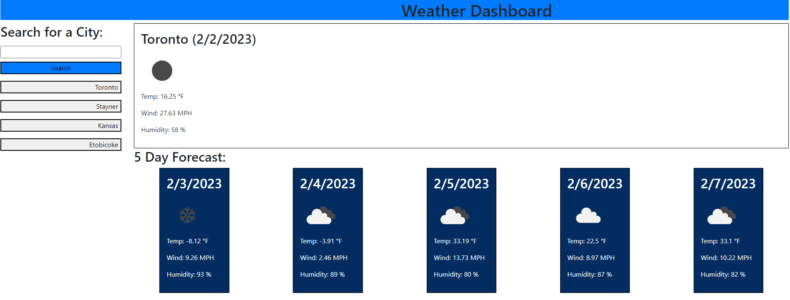

# Weather-Dashboard

## Description

This program offers the user the ability to check the weather in any given place by entering the name of a city. 
The user is then given the current weather in that area as well as a 5 day forecast on what to expect in the 
coming days. Cities that have been previously search before are saved into a button which the user can click to view
it again with ease.

## Links

Repository:
https://github.com/JacksonR-K/Weather-Dashboard

Deployed Application:
https://jacksonr-k.github.io/Weather-Dashboard
